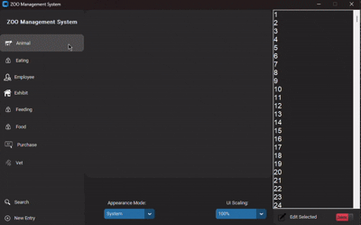
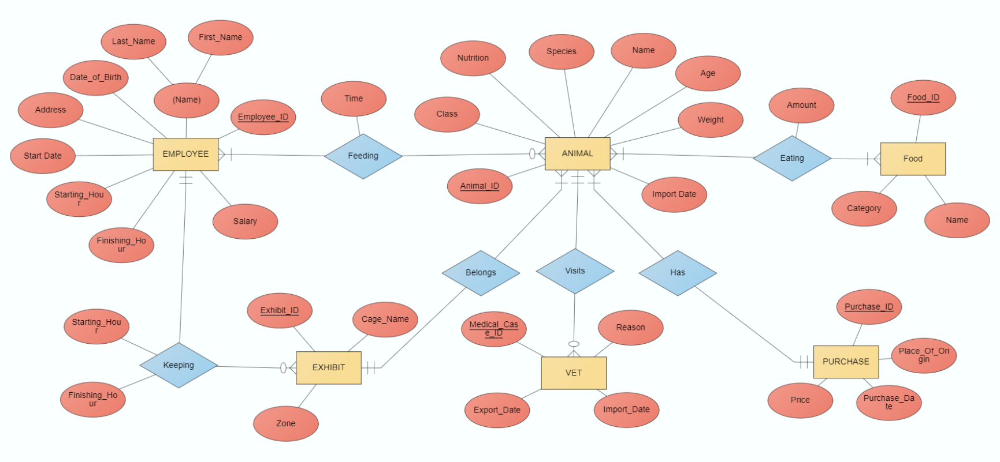

# ZOO-DBMS

**ZOO-DBMS** is a database management system designed for managing zoo operations, including **animal records, employee management, and exhibit details**.  

<p align="center">
  
</p>


## Features  

- 🐾 **Animal Management** – Add, edit, and track zoo animals with detailed information like species, age, and health status.
- 👥 **Employee Management** – Manage zoo personnel, assign roles, and keep track of schedules.
- 🎢 **Exhibit Information** – Store and manage details about various zoo exhibits, including their locations and animal inhabitants.
- 🗄️ **SQLite Database** – Utilizes SQLite for efficient data storage and management, ensuring smooth performance even with large datasets.
- 🖥️ **Graphical Interface** – User-friendly graphical interface (GUI) for easy interaction with the database. 

## 🗄 Database Design
The database follows a relational model to efficiently store and manage zoo data. Here’s the Entity-Relationship Diagram (ERD) that visualizes the relationships between different entities:


## Getting Started

### 1. Dependencies

No additional library installations are required, as they are automatically handled by the program during execution.

### 2. Run the Program

To run the program, simply execute the GUI.py file. The program will automatically set up the database and generate the necessary fake data.

``` python GUI.py ```

This will launch the ZOO-DBMS GUI, allowing you to interact with the database and explore features like managing animals, employees, and exhibits.
