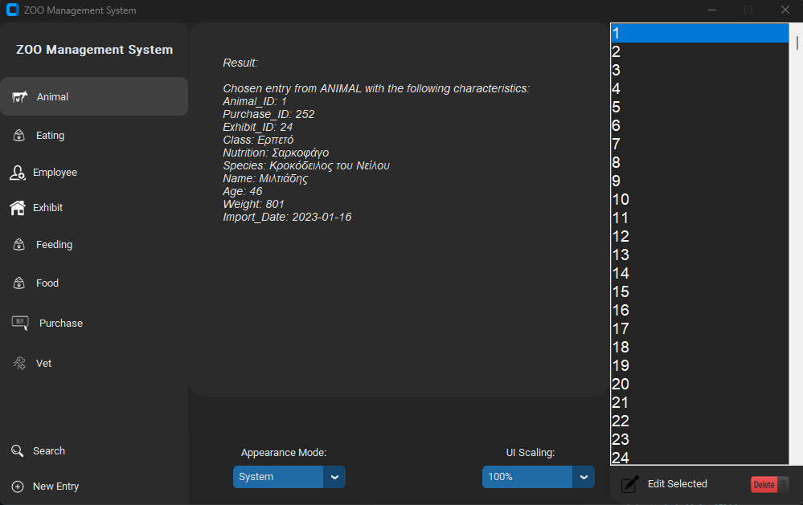

# ZOO-DBMS

**ZOO-DBMS** is a database management system designed for managing zoo operations, including **animal records, employee management, and exhibit details**.  



## Features  

- 🐾 **Animal Management** – Add, edit, and track zoo animals.  
- 👥 **Employee Management** – Manage personnel and schedules.  
- 🎢 **Exhibit Information** – Store details about different zoo exhibits.  
- 📊 **Reports & Statistics** – Retrieve insights into zoo operations.  
- 🖥️ **Graphical Interface** – User-friendly GUI for database interaction.  

## ▶️ Demo  

 

## 🗄 Database Design
The database follows a relational model to efficiently store and manage zoo data.


## Installation Instructions

Follow the steps below to install the zoo management application on your computer:

### If you have Git installed

## Execute the GUI.py file

A prerequisite is to have Python installed on your computer.
After extracting the folder, navigate to it from the command line and execute the following command to start the application:

```bash
python GUI.py
```

No additional library installations are required, as they are automatically handled by the program during execution.